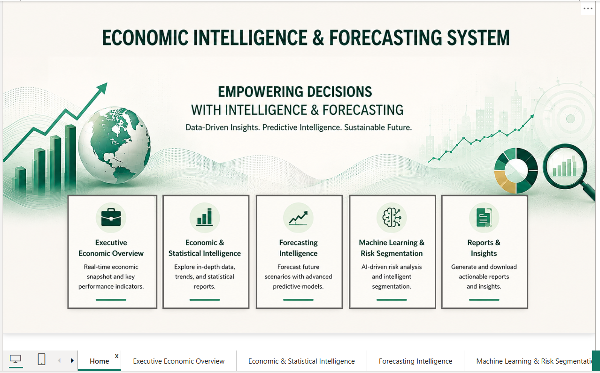
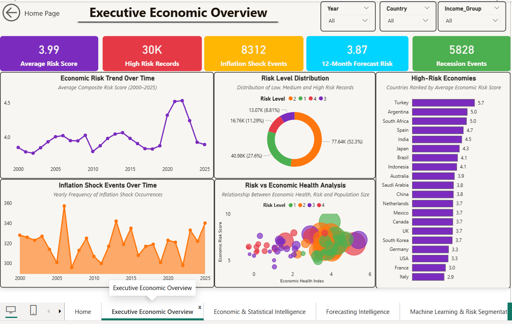
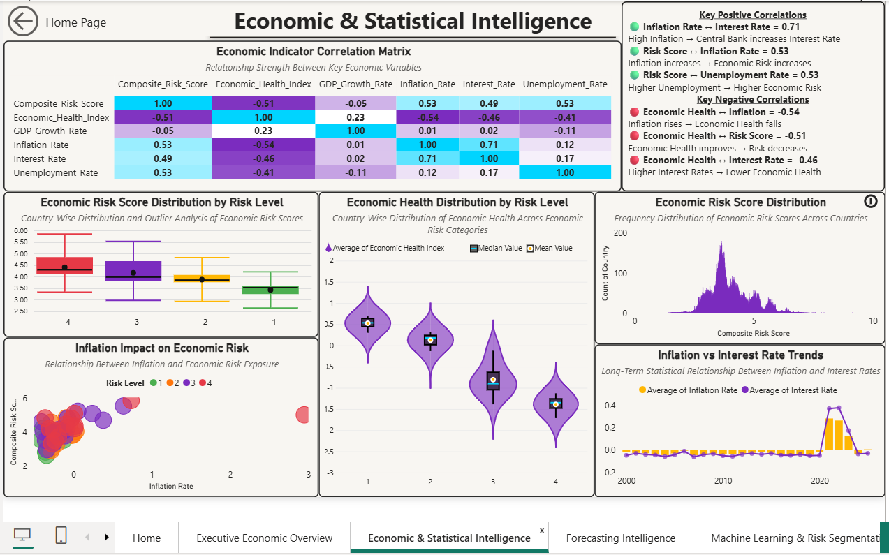
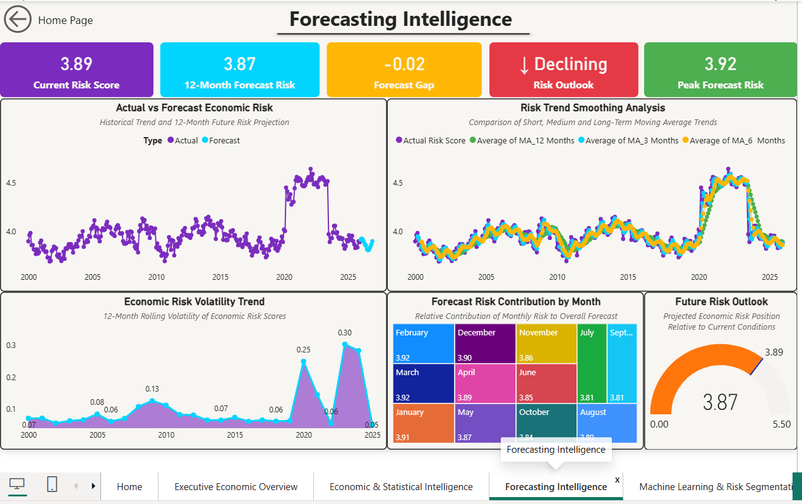
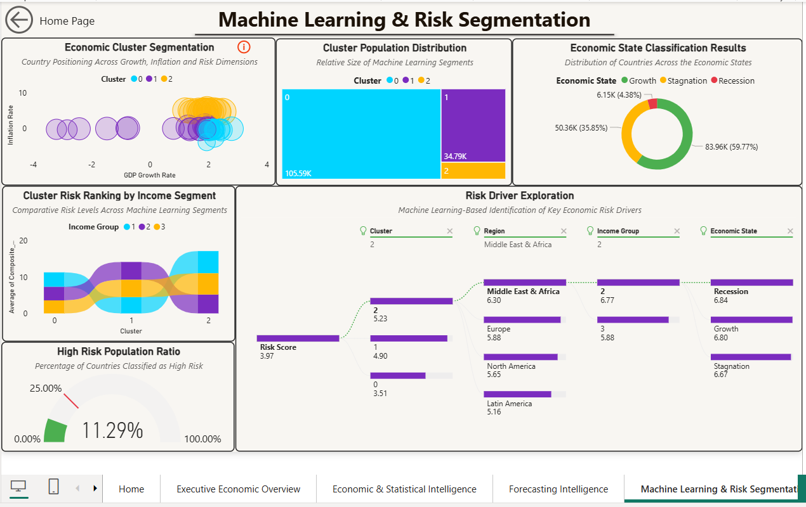
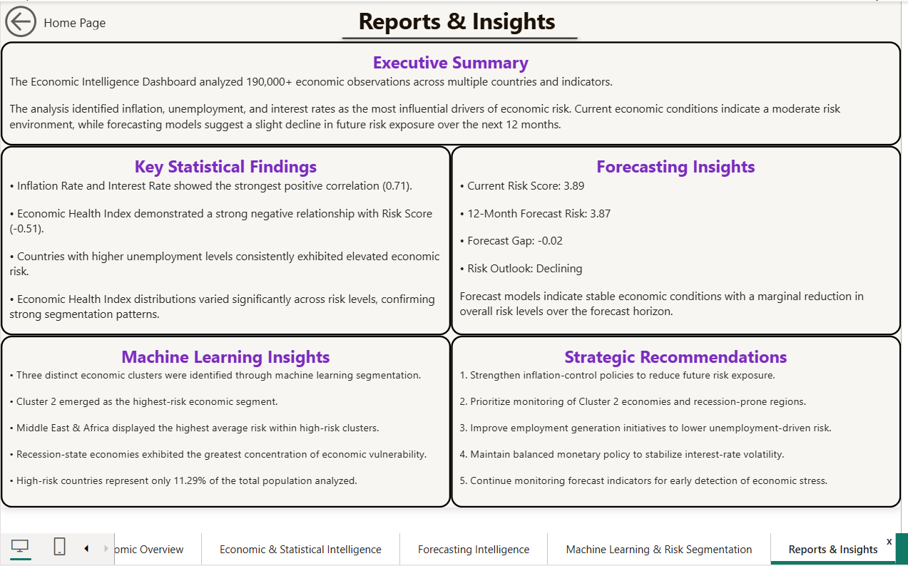

# 🌍 Economic Intelligence & Forecasting System

An end-to-end **Economic Analytics, Machine Learning & Forecasting Project** built with **Python → Machine Learning → Time Series Forecasting → Power BI**

---

## 🔗 Live Dashboard

Click here to view the Power BI dashboard:

[View Dashboard](https://app.fabric.microsoft.com/links/UWYbqIqsZi?ctid=ca67eede-0f19-4a59-bb1c-da269bed9be1&pbi_source=linkShare)

---

---

## 📌 Project Overview

This project is a comprehensive Economic Intelligence and Forecasting platform designed to analyze global economic indicators, identify economic risks, discover hidden patterns using machine learning, and forecast future economic conditions.

The project combines:

- Advanced Statistics
- Exploratory Data Analysis (EDA)
- Inferential Statistics
- Machine Learning
- Clustering Analysis
- Time Series Forecasting
- Economic Risk Modeling
- Interactive Power BI Dashboards

The objective was to transform complex economic datasets into actionable business intelligence and strategic decision-support insights.

---

## 🗂️ Project Workflow

**Raw Economic Dataset → Data Cleaning → Advanced Statistics → Machine Learning → Time Series Forecasting → Power BI Dashboard**

---

## 🛠️ Tools & Technologies

| Tool | Purpose |
|--------|---------|
| Python | Data Cleaning, EDA, Statistics, Machine Learning |
| Pandas | Data Manipulation |
| NumPy | Numerical Computation |
| Matplotlib | Data Visualization |
| Seaborn | Statistical Visualization |
| SciPy | Statistical Testing |
| Statsmodels | Econometrics & Time Series |
| Scikit-Learn | Machine Learning |
| Prophet | Forecasting |
| Power BI | Dashboard Development |
| DAX | KPI & Business Measures |

---

## 🔷 Step 1: Data Preparation & Cleaning

### What I Did

- Imported and validated economic datasets
- Checked missing values
- Removed duplicate records
- Corrected data types
- Handled invalid and negative values
- Performed outlier analysis
- Created engineered features
- Built economic indicators and risk metrics

### Output

A clean analytical dataset containing:

- GDP Indicators
- Inflation Metrics
- Interest Rates
- Trade Statistics
- Labor Market Indicators
- Economic Risk Variables
- Forecasting Variables
- Machine Learning Features

---

## 🔶 Step 2: Advanced Statistical Analysis

The project includes more than **86+ analytical and statistical techniques**.

### Descriptive Statistics

- Mean
- Median
- Mode
- Range
- Variance
- Standard Deviation
- Coefficient of Variation
- Quartiles
- IQR Analysis

### Distribution Analysis

- Histogram
- KDE Plot
- Box Plot
- Violin Plot
- QQ Plot

### Outlier Detection

- IQR Method
- Z-Score Method

### Correlation Analysis

- Pearson Correlation
- Spearman Correlation
- Kendall Correlation
- Correlation Matrix

### Statistical Testing

- T-Test
- ANOVA
- Chi-Square Test
- Shapiro-Wilk Test
- Kolmogorov-Smirnov Test

### Confidence & Risk Analysis

- Confidence Intervals
- Margin of Error
- Probability Analysis
- Risk Assessment

### Simulation & Experimentation

- Monte Carlo Simulation
- A/B Testing

---

## 🤖 Step 3: Machine Learning & AI Analytics

### Feature Engineering

Created advanced economic indicators:

- Economic Health Index
- Debt Pressure Score
- Purchasing Power Stress
- External Vulnerability
- Composite Risk Score

### Clustering Analysis

Applied Machine Learning clustering to identify hidden economic segments.

#### Outputs

- Economic Clusters
- Risk Segmentation
- Economic State Classification

### Classification & Risk Modeling

Built economic state identification models.

#### Outputs

- Growth State
- Recession State
- Stagnation State

---

## 🔮 Step 4: Time Series Forecasting

Performed advanced forecasting to estimate future economic risk conditions.

### Time Series Analysis

- Trend Analysis
- Rolling Mean
- Rolling Standard Deviation
- Seasonality Detection
- Stationarity Testing

### Statistical Tests

- Augmented Dickey-Fuller (ADF)
- KPSS Test

### Forecasting Models

- ARIMA
- SARIMA
- Prophet
- VAR (Vector Auto Regression)

### Forecast Outputs

- Forecast Risk Score
- Future Economic Trends
- Forecast Volatility
- Confidence Bands
- Forecast Risk Outlook

---

## 📁 Python Output Files

| Output File | Description |
|------------|-------------|
| economic_intelligence_final.csv | Final analytical dataset |
| economic_risk_forecast_12m.csv | 12-Month forecasting output |
| correlation_analysis.csv | Correlation analysis output |
| cluster_analysis.csv | Machine learning cluster output |
| risk_segmentation.csv | Risk classification output |
| statistical_summary.csv | Statistical summary results |

---

## 📊 Power BI Dashboard

The Power BI dashboard was built using the final processed datasets generated through the Python analytics pipeline.

> **Note:** The Power BI dashboard does not use the raw dataset directly. It utilizes the final analytical datasets generated from Python, including statistical outputs, forecasting results, machine learning segmentation, correlation analysis, and economic risk intelligence metrics specifically prepared for dashboard development.

---

## 📈 Dashboard Pages

### 🏠 Home

- Interactive Navigation
- Dashboard Overview
- Project Introduction

---

### 📊 Executive Economic Overview

#### Key KPIs

- Economic Health Index
- Composite Risk Score
- GDP Growth Rate
- Inflation Rate
- Unemployment Rate

#### Visuals

- Economic Risk Trends
- Country Performance Analysis
- Risk Distribution
- Economic Health Monitoring

---

### 📉 Economic & Statistical Intelligence

#### Visuals

- Correlation Matrix
- Box Plot Analysis
- Violin Plot Analysis
- Histogram Distribution
- Inflation vs Risk Analysis

#### Insights

- Variable Relationships
- Distribution Patterns
- Outlier Detection
- Statistical Trends

---

### 🔮 Forecasting Intelligence

#### Key Metrics

- Forecast Risk Score
- Forecast Volatility
- Risk Outlook
- Future Economic Trends

#### Visuals

- Actual vs Forecast Trend
- Rolling Mean Analysis
- Forecast Volatility Analysis
- Monthly Forecast Contribution
- Future Risk Outlook Gauge

---

### 🤖 Machine Learning & Risk Segmentation

#### Key Metrics

- ML Clusters
- High Risk Cases
- Recession Signals
- Shock Events
- State Classes

#### Visuals

- AI-Based Economic Cluster Segmentation
- Cluster Population Distribution
- Economic State Classification
- Risk Profile Comparison
- AI Risk Driver Exploration

---

### 📑 Reports & Strategic Insights

#### Content

- Executive Summary
- Statistical Findings
- Forecasting Insights
- Machine Learning Insights
- Strategic Recommendations
- Final Economic Assessment

---

## 📸 Dashboard Preview

### 🔹 Home Page

### 🔹 Executive Economic Overview

### 🔹 Economic & Statistical Intelligence

### 🔹 Forecasting Intelligence

### 🔹 Machine Learning & Risk Segmentation

### 🔹 Reports & Strategic Insights

---

## 💡 Key Business Insights

- Inflation and Interest Rates exhibit strong positive correlation.
- Economic Health Index is negatively associated with Risk Score.
- Cluster 2 represents the highest-risk economic segment.
- High-risk countries account for a small percentage of the total population analyzed.
- Forecast models indicate relatively stable economic conditions over the forecast horizon.
- Recession-state economies demonstrate the highest concentration of economic vulnerability.
- Machine learning segmentation reveals distinct economic behavior patterns across regions.

---

## 🧠 Skills Demonstrated

- ✅ Advanced Statistical Analysis
- ✅ Exploratory Data Analysis (EDA)
- ✅ Inferential Statistics
- ✅ Hypothesis Testing
- ✅ Correlation Analysis
- ✅ Machine Learning
- ✅ Clustering & Segmentation
- ✅ Time Series Analysis
- ✅ Forecasting Models
- ✅ Economic Risk Modeling
- ✅ Feature Engineering
- ✅ Power BI Data Modeling
- ✅ DAX Measures
- ✅ Business Intelligence Reporting
- ✅ Data Storytelling
- ✅ End-to-End Analytics Pipeline

---

## 👨‍💻 About Me

**Sayan Naha**

📧 Email: snsayan2012@gmail.com

🔗 LinkedIn: https://www.linkedin.com/in/sayan-naha/

